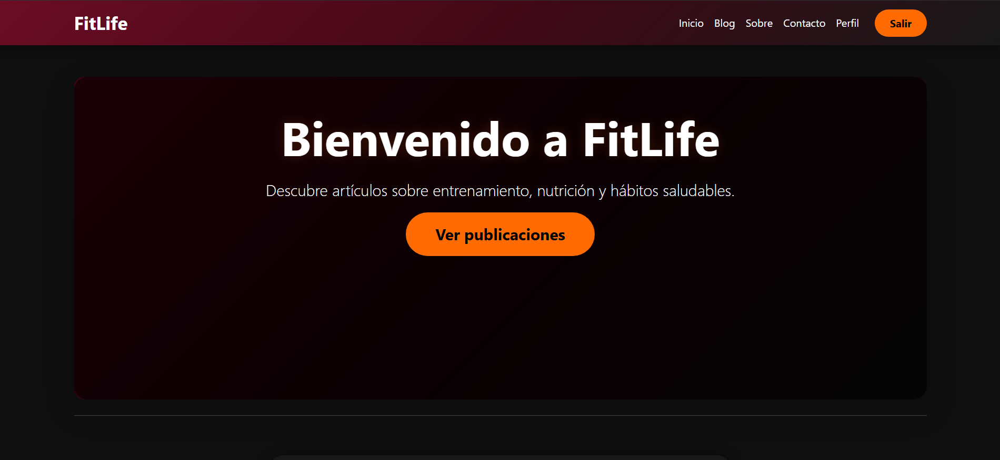
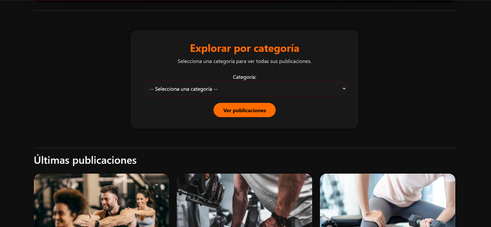
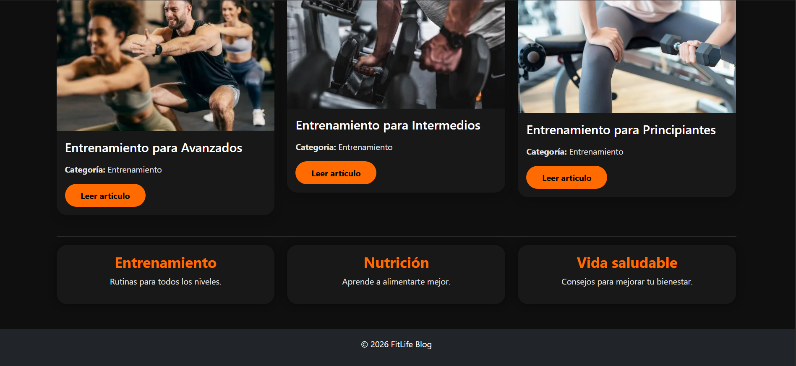
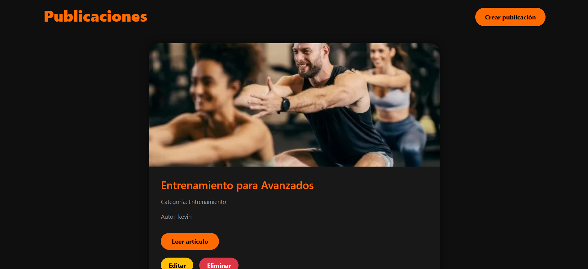
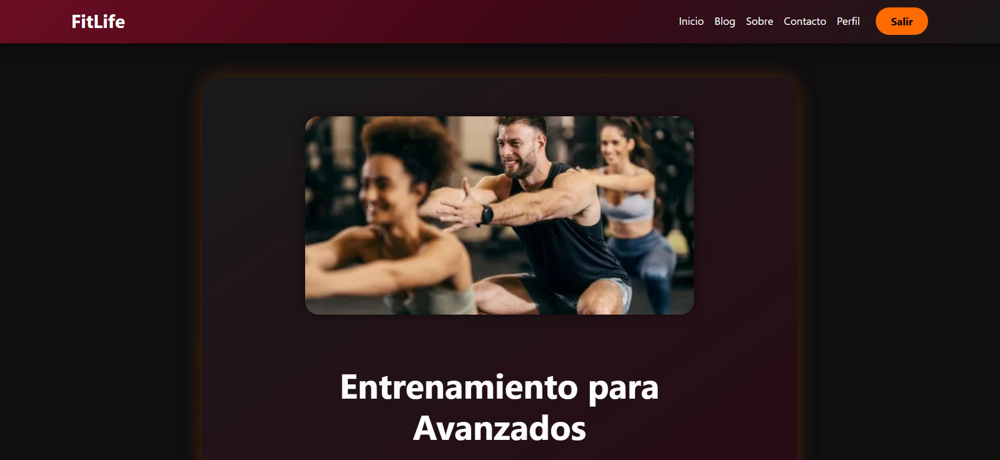
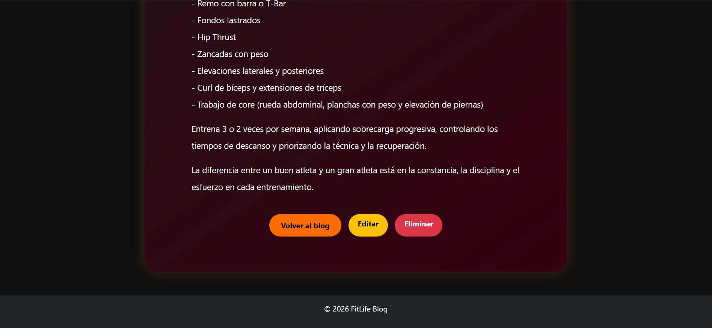
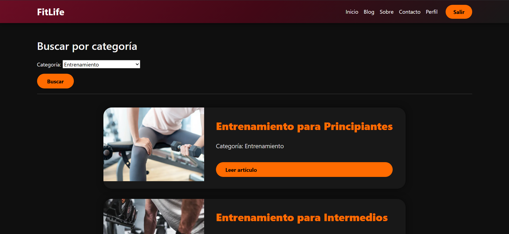

# FitLife Blog

## Descripción del proyecto

FitLife Blog permite compartir publicaciones relacionadas con entrenamiento, nutrición y hábitos saludables

El proyecto permite que adonde cada persona puede registrarse, iniciar sesión y administrar su perfil personal.

### Funcionalidades principales:

- Registro y iniciar de sesión de los usuarios.
- Creación, edición y eliminación de publicaciones.
- Sistema de categorías para organizar artículos.
- Búsqueda de publicaciones por categoría.
- Perfil de usuario con avatar e información personal.
- Cambio de contraseña.
- Subida de imágenes para publicaciones y perfiles.
- Restricción de edición y eliminación únicamente para el autor de la publicación.
- Diseño responsive utilizando Bootstrap y CSS.

## Tecnologías utilizadas

- Python 3
- Django 6
- HTML5
- CSS3
- Bootstrap 5
- JavaScript
- SQLite

# Instalación y ejecución local

## 1. Clonar el repositorio

```bash
git https://github.com/kevinN56/Proyecto_Final.git
```

Ingresar a la carpeta:

```bash
cd Proyecto_Final
```

## 2. Crear un entorno virtual

Windows:

```bash
python -m venv venv
```

Activar entorno virtual:

```bash
venv\Scripts\activate
```

Linux/Mac:

```bash
source env/bin/activate
```

## 3. Instalar dependencias

Ejecutar:

```bash
pip install -r requirements.txt
```

## 4. Realizar migraciones

```bash
python manage.py migrate
```

## 5. Crear un usuario administrador (opcional)

```bash
python manage.py createsuperuser
```

## 6. Ejecutar el servidor local

```bash
python manage.py runserver
```

Abrir en el navegador:

```
http://127.0.0.1:8000/
```

# Configuración de imágenes

El proyecto utiliza archivos multimedia para almacenar imágenes de publicaciones y avatares.

En `settings.py`:

```python
MEDIA_URL = "/media/"

MEDIA_ROOT = BASE_DIR / "media"
```

# URL pública

La aplicación se encuentra publicada en:

```
https://url-publica-del-proyecto.com
```

_(Reemplazar por la URL real cuando sea desplegada)._

# Capturas de pantalla de las Paginas para ver sus Funcionamientos

## Página de inicio





## Blog



## Detalle de una publicación




## Perfil


## Buscar por categoría


